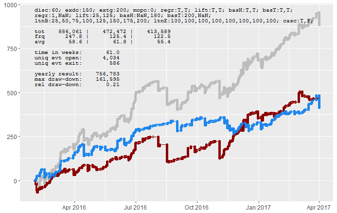
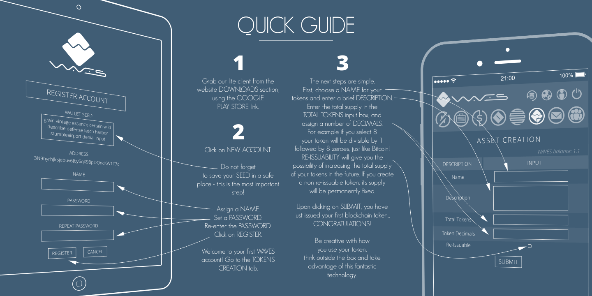

#### Welcome to GitHub Pages?@

You can use the [editor on GitHub](https://github.com/neura-pro/neura-pro.github.io/edit/master/index.md) to *maintain* and preview the content for your website in Markdown files.

[Whenever](mission.md) you commit to this repository, GitHub Pages will run [Jekyll](https://jekyllrb.com/) to rebuild the pages in your site, from the content in your Markdown files.

### Markdown?

Markdown is a lightweight and easy-to-use syntax for styling your writing.

> The platform must be decentralized, permissionless, and trustless
> for such a liquidity pool to exist. With these requirements in mind, the Gnosis team has selected the
> Ethereum network as the core protocol upon which the platform will be built.

## Information Revolution

Generally speaking, the Information Revolution has made it easier for individuals to quickly retrieve
data about any topic. Despite the ease of access we enjoy today, this form of information aggregation
still requires a great deal of coordination to be effective. More often than not, the data is severely
lacking in context and objectivity and requires heavier lifting to produce actionable information
for use in decision-making processes. The reason for this is straightforward: written information
is inextricably linked to the writer’s individual biases and agenda, making it difficult to delineate
useful information from opinions or intentional misinformation. In other words, it’s easy to find
what people have said but hard to ascertain what they actually believe.

[website](http://neura.pro)

For more details see [GitHub Flavored Markdown](https://guides.github.com/features/mastering-markdown/).

### Jekyll Themes

Your Pages site will use the layout and styles from the Jekyll theme you have selected in your [repository settings](https://github.com/neura-pro/neura-pro.github.io/settings). The name of this theme is saved in the Jekyll `_config.yml` configuration file.

### Support or Contact

Having trouble with Pages? Check out our [documentation](https://help.github.com/categories/github-pages-basics/) or [contact support](https://github.com/contact) and we’ll help you sort it out.
