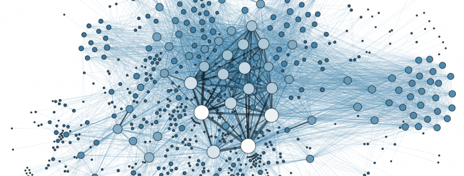

## Mission Statement

Gnosis will be a disruptive force driving change in a number of systemically important global
markets, including finance, gambling, insurance, and information. Gnosis prediction markets will
also find applications in new forms of distributed, market-based governance protocols, and will
provide unique incentivization opportunities for both local and global economies.

> Our mission is to build an accessible prediction market platform enabling the free
> flow of useful information.

Gnosis is well-positioned as a medium for a long-term shift toward information arbitrage
economies that will power the Internet of Things, as well as more advanced forms of artificial
intelligence. We believe that we are on the cusp of a Cambrian explosion of machine intelligence
that will leverage a global liquidity pool of information for decision-making and will be deeply
interwoven on a shared blockchain fabric such as Ethereum. Decentralized prediction markets seeded
on Gnosis will be the ideal medium of exchange for these intelligent agents.

Over the past couple of weeks, our team has been working through the Steem Dollar mechanics in an effort to secure the economic foundation of Steem against black swan events. It should be obvious to all that if at any point in the future the market cap of Steem fell below the supply of Steem Dollars then the Steem Dollar would break. Long before that happened there would be a *run on the bank*.

## Extremely Unlikely but not Impossible

We designed the Steem incentives to always push Steem toward a Steem Dollar supply equal to about 5% of the available market cap. This happens because for every Steem Dollar we create we create about 19 Steem Dollar’s worth of Steem and Steem Power.

This system works well when the market cap is rising or relatively stable, but there is one edge case which could cause the system to unravel. When the market cap falls and pushes the Steem Dollar ratio to dangerously high levels (20% or more of market cap), then the network must start paying off its “debt” with “equity” and reducing the Steem Dollar supply.