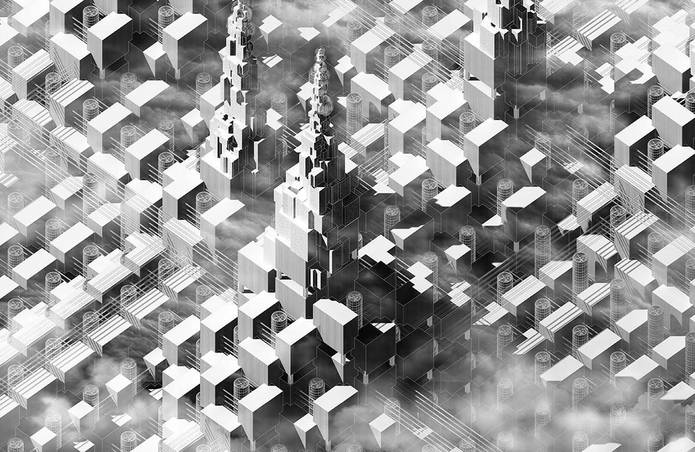

### Mission Statement

> Our mission is to build an accessible prediction market platform enabling the free
> flow of useful information.

Gnosis will be a disruptive force driving change in a number of systemically important global
markets, including finance, gambling, insurance, and information. Gnosis prediction markets will
also find applications in new forms of distributed, market-based governance protocols, and will
provide unique incentivization opportunities for both local and global economies.
Gnosis is well-positioned as a medium for a long-term shift toward information arbitrage
economies that will power the Internet of Things, as well as more advanced forms of artificial
intelligence. We believe that we are on the cusp of a Cambrian explosion of machine intelligence
that will leverage a global liquidity pool of information for decision-making and will be deeply
interwoven on a shared blockchain fabric such as Ethereum. Decentralized prediction markets seeded
on Gnosis will be the ideal medium of exchange for these intelligent agents.

